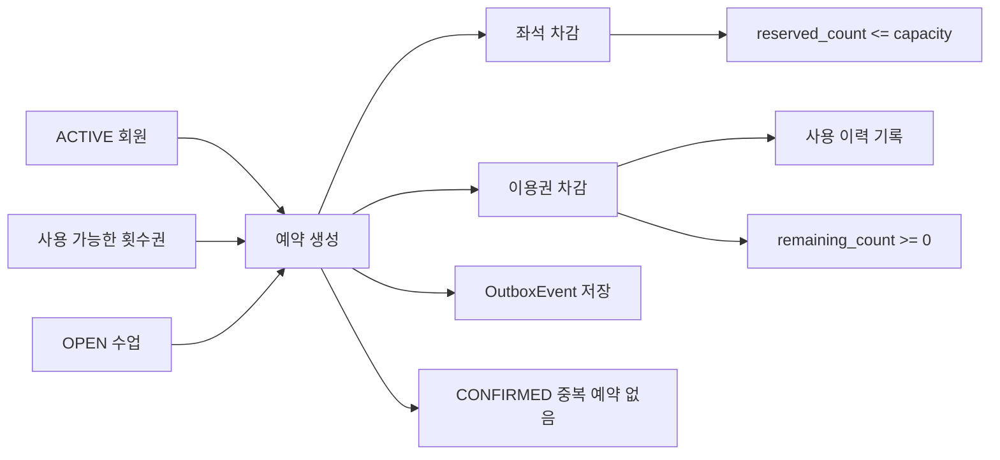
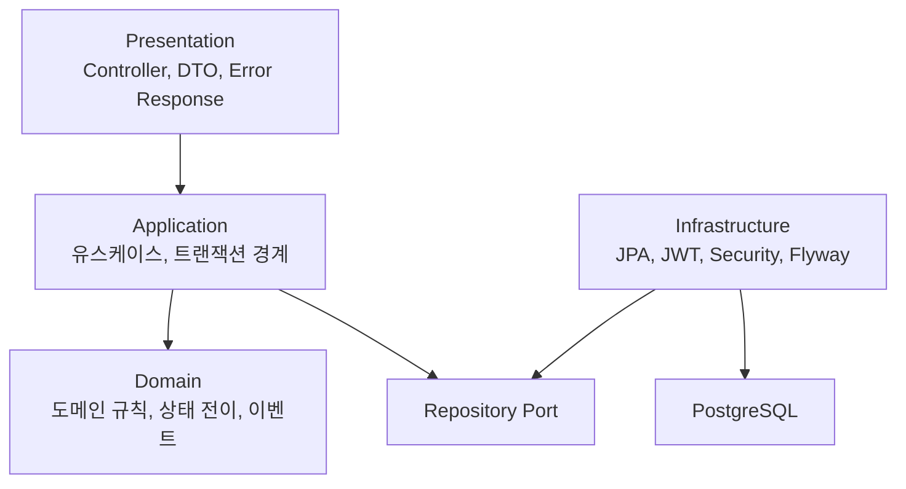
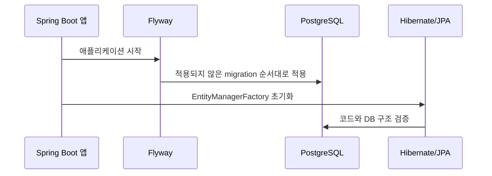

<div align="center">

# ClimbDesk

회원권 기반 클라이밍 수업 예약을 안정적으로 처리하는 Kotlin/Spring Boot 백엔드


<br />


<br />

> **해결하는 문제:** 중복 예약, 정원 초과, 이용권 음수 차감처럼 예약 운영에서 깨지기 쉬운 정합성 문제를 다룹니다.<br />
> **지키는 방법:** 트랜잭션 경계, 도메인 불변조건, PostgreSQL 제약조건, 비관적/낙관적 락으로 핵심 상태 변화를 보호합니다.<br />
> **실행 방법:** PostgreSQL 연결 정보를 설정한 뒤 `./gradlew bootRun`으로 실행합니다.

<br />

<a href="#왜-climbdesk인가"><strong>왜 ClimbDesk인가</strong></a>
·
<a href="#설계-노트"><strong>설계 노트</strong></a>
·
<a href="#빠른-실행"><strong>빠른 실행</strong></a>
·
<a href="#구조"><strong>구조</strong></a>
·
<a href="#api-지도"><strong>API 지도</strong></a>
·
<a href="#테스트"><strong>테스트</strong></a>

</div>

---

## 왜 ClimbDesk인가

ClimbDesk는 단순한 수업 예약 CRUD가 아니라, 한 번의 예약이 여러 데이터의 불변조건을 깨지 않고 끝까지 완료되는지를 다룹니다.

| 초점 | 설명 |
| --- | --- |
| 예약 정합성 | 같은 회원의 같은 수업 중복 예약을 막고 정원 초과를 방지합니다. |
| 이용권 사용 이력 | 예약 생성/취소 시 이용권 차감과 복구 이력을 남깁니다. |
| 트랜잭션 일관성 | 좌석, 이용권, 사용 이력, outbox event를 같은 트랜잭션에 묶습니다. |
| 동시성 제어 | ClassSession 비관적 락과 MemberPass 낙관적 버전으로 동시성 충돌을 다룹니다. |
| 영속성 신뢰성 | Flyway가 DB 구조를 만들고 Hibernate가 코드와 DB가 맞는지 검증합니다. |
| 테스트 자동화 | PostgreSQL Testcontainers로 DB 규칙, 락, 트랜잭션 동작을 검증합니다. |

## 설계 노트

| 문제 | 결정 | 이유 |
| --- | --- | --- |
| 예약 생성은 수업, 이용권, 예약, 사용 이력이 함께 바뀝니다. | 예약 생성 서비스가 전체 흐름을 한 번에 조율합니다. | 중간에 실패했을 때 앞에서 바꾼 좌석이나 이용권까지 함께 되돌려야 하기 때문입니다. |
| 같은 수업에 동시 예약이 들어오면 정원이 초과될 수 있습니다. | 수업 좌석을 바꾸는 동안 같은 수업을 동시에 수정하지 못하도록 DB 락을 사용합니다. | MVP에서는 자동 재시도보다 `reserved_count <= capacity`를 확실히 지키는 쪽을 우선합니다. |
| 같은 회원이 같은 수업을 중복 예약할 수 있습니다. | 코드에서 먼저 확인하고, DB에서도 조건부 중복 방지 규칙으로 한 번 더 막습니다. | 동시에 요청이 들어오면 코드 검사만으로는 부족할 수 있기 때문입니다. |
| DB 구조를 Hibernate 자동 생성에 맡기면 중요한 DB 규칙이 흐려질 수 있습니다. | Flyway SQL 파일로 테이블과 제약조건을 만들고, JPA는 실제 DB와 코드가 맞는지만 확인합니다. | 예약 정합성에 필요한 DB 규칙을 명시적으로 관리하기 위해서입니다. |
| 새 DB에는 첫 MANAGER 계정이 필요하지만 인증 없는 생성 API는 위험합니다. | 첫 계정은 수동 SQL로 만들고 이후 Admin API는 MANAGER 권한 뒤에 둡니다. | 초기 설정 편의성보다 관리자 생성 경로를 보호하는 쪽을 우선했습니다. |
| 도메인 규칙이 API나 JPA 코드에 섞일 수 있습니다. | 요청/응답 DTO, 유스케이스 입력, 도메인 모델, JPA Entity를 분리합니다. | 각 코드가 바뀌는 이유가 다르므로 한 곳에 섞이면 변경 영향이 커지기 때문입니다. |
| H2 기반 테스트로는 PostgreSQL의 락, 중복 방지 규칙, 제약조건 동작 차이를 검증하기 어렵습니다. | 핵심 통합 테스트는 PostgreSQL Testcontainers에서 실행합니다. | 예약 정합성은 실제 DB의 동작까지 포함해 검증해야 합니다. |

## 빠른 실행

```shell
cp .env.example .env
```

`.env`에 실제 PostgreSQL/Neon 접속 정보와 JWT secret을 입력합니다.

```dotenv
CLIMBDESK_DATASOURCE_URL=jdbc:postgresql://your-neon-host/your-database?sslmode=require
CLIMBDESK_DATASOURCE_USERNAME=your_neon_username
CLIMBDESK_DATASOURCE_PASSWORD=your_neon_password
CLIMBDESK_JWT_SECRET=replace_with_a_long_random_secret
CLIMBDESK_JWT_EXPIRES_IN=3600
```

Spring Boot는 `.env` 파일을 자동으로 읽지 않으므로 실행 전에 shell 환경으로 export합니다.

```shell
set -a
source .env
set +a
./gradlew bootRun
```

```shell
curl -i http://localhost:8080/actuator/health
```

## 핵심 흐름



## 구조



## 정합성 보드

| 지켜야 할 규칙 | 코드/실행 방어 | DB 방어 | 테스트 대상 |
| --- | --- | --- | --- |
| `reserved_count <= capacity` | ClassSession 비관적 락, 도메인 규칙 | check constraint | 동시 예약, 정원 초과 |
| `remaining_count >= 0` | MemberPass 도메인 규칙, 낙관적 버전 | check constraint | 이용권 차감/복구 |
| 같은 회원의 같은 수업 CONFIRMED 예약은 1개 | 코드 사전 검증 | partial unique index | 중복 예약 |
| 예약 생성은 원자적으로 처리 | 예약 생성 서비스의 트랜잭션 | FK/check constraint | 좌석, 이용권, 이력, outbox |
| 예약 취소는 원자적으로 처리 | 예약 취소 서비스의 트랜잭션 | FK/check constraint | 좌석 복구, 이용권 복구, 이력 |

## API 지도

기본 URL은 `/api/v1`입니다. `POST /auth/login`과 헬스 체크 엔드포인트를 제외한 API는 JWT 인증을 요구합니다.

| 영역 | 엔드포인트 |
| --- | --- |
| Auth | `POST /api/v1/auth/login` |
| Admin | `POST /api/v1/admin-users`, `PATCH /api/v1/admin-users/{id}/role`, `PATCH /api/v1/admin-users/{id}/activate`, `PATCH /api/v1/admin-users/{id}/deactivate` |
| Member | `POST /api/v1/members`, `GET /api/v1/members`, `GET /api/v1/members/{id}`, `PATCH /api/v1/members/{id}/deactivate` |
| Pass | `POST /api/v1/pass-products`, `GET /api/v1/pass-products`, `GET /api/v1/pass-products/{id}`, `POST /api/v1/member-passes`, `GET /api/v1/members/{memberId}/passes`, `GET /api/v1/member-passes/{id}/usage-histories` |
| Class Session | `POST /api/v1/class-sessions`, `GET /api/v1/class-sessions`, `GET /api/v1/class-sessions/{id}`, `PATCH /api/v1/class-sessions/{id}/cancel` |
| Reservation | `POST /api/v1/reservations`, `GET /api/v1/reservations`, `GET /api/v1/reservations/{id}`, `PATCH /api/v1/reservations/{id}/cancel` |

## MVP 범위

| 포함 | 제외 |
| --- | --- |
| 관리자 로그인, JWT, MANAGER/STAFF 권한 | 공개 회원가입, demo 계정, 자동 seed 계정 |
| 회원 등록/조회/비활성화 | 프론트엔드 UI |
| 횟수권 상품과 회원 이용권 | 기간권, 일일권, 복합 이용권 |
| 수업 생성/조회/취소 | 수업 수정, 반복 수업, 강사 배정 |
| 예약 생성/조회/취소 | 대기 예약, 출석 체크, 노쇼 처리 |
| outbox_events 저장 | 실제 알림 발송, SQS/Kafka broker 연동 |
| Neon 또는 외부 PostgreSQL 연결 | Docker Compose 로컬 DB |

## 실행 요구사항

| 요구사항 | 설명 |
| --- | --- |
| JDK 25 | Kotlin JVM toolchain이 25로 설정되어 있습니다. |
| Gradle Wrapper | 저장소의 `./gradlew`를 사용합니다. |
| PostgreSQL 16+ | 로컬 실행은 Neon 또는 외부 PostgreSQL 연결 기준입니다. |
| Docker | PostgreSQL Testcontainers 기반 통합 테스트에 필요합니다. |

## 환경 변수

| 변수 | 필수 | 기본값 | 설명 |
| --- | --- | --- | --- |
| `CLIMBDESK_DATASOURCE_URL` | 예 | 없음 | PostgreSQL JDBC URL |
| `CLIMBDESK_DATASOURCE_USERNAME` | 예 | 없음 | PostgreSQL 사용자명 |
| `CLIMBDESK_DATASOURCE_PASSWORD` | 예 | 없음 | PostgreSQL 비밀번호 |
| `CLIMBDESK_JWT_SECRET` | 예 | 없음 | 긴 임의 문자열을 반드시 설정합니다. 빈 값이면 애플리케이션 시작이 실패합니다. |
| `CLIMBDESK_JWT_EXPIRES_IN` | 아니오 | `3600` | JWT 만료 시간, 초 단위 |

## 스키마 시작 순서



Flyway가 schema 생성과 변경을 담당하고, Hibernate는 `ddl-auto=validate`로 JPA Entity mapping이 실제 PostgreSQL schema와 맞는지만 검증합니다. Entity와 migration이 어긋나면 애플리케이션 시작 또는 migration 기반 테스트에서 실패해야 합니다.

기존 DB에 새 migration을 적용할 때는 적용 전 데이터를 먼저 확인하는 편이 좋습니다. 예를 들어 V2는 취소된 수업의 `cancel_reason`을 필수로 바꾸기 전에, 기존 `CANCELED` 수업 중 `cancel_reason`이 비어 있는 행을 `"Migrated without cancel reason"`으로 보정합니다.

```sql
select id, title, canceled_at, cancel_reason
from class_sessions
where status = 'CANCELED'
  and cancel_reason is null;
```

## 첫 MANAGER 계정 만들기

새 DB에는 자동 seed 계정이나 demo 계정이 없습니다. `POST /api/v1/admin-users`는 MANAGER 권한이 필요한 API이므로, 첫 MANAGER 계정은 migration 적용 후 수동 SQL로 한 번 생성합니다.

<details>
<summary>수동 생성 절차 보기</summary>

```shell
jshell
```

```java
import java.security.SecureRandom;
import java.util.Base64;
import javax.crypto.SecretKeyFactory;
import javax.crypto.spec.PBEKeySpec;

var password = new String(System.console().readPassword("Bootstrap MANAGER password: "));
var salt = new byte[16];
new SecureRandom().nextBytes(salt);
var spec = new PBEKeySpec(password.toCharArray(), salt, 210000, 256);
var hash = SecretKeyFactory.getInstance("PBKDF2WithHmacSHA256").generateSecret(spec).getEncoded();
System.out.println("pbkdf2_sha256$210000$" + Base64.getEncoder().encodeToString(salt) + "$" + Base64.getEncoder().encodeToString(hash));
```

```sql
insert into admin_users (
  email,
  password_hash,
  role,
  status,
  created_at,
  updated_at
) values (
  '<manager-email>',
  '<password-hash>',
  'MANAGER',
  'ACTIVE',
  now(),
  now()
);
```

```shell
curl -i -X POST "http://localhost:8080/api/v1/auth/login" \
  -H "Content-Type: application/json" \
  -d '{"email":"<manager-email>","password":"<raw-password>"}'
```

성공하면 응답에 `accessToken`, `tokenType=Bearer`, `adminUser.role=MANAGER`, `adminUser.status=ACTIVE`가 포함됩니다. 이후 관리자 추가는 반환된 access token으로 `POST /api/v1/admin-users`를 호출해 진행합니다.

</details>

## 테스트

```shell
./gradlew test
```

```shell
./gradlew check
```

테스트에는 단위 테스트, Web/API 테스트, PostgreSQL Testcontainers 기반 통합 테스트가 포함됩니다. Docker가 실행 중이지 않으면 `@Testcontainers(disabledWithoutDocker = true)`가 붙은 PostgreSQL 통합 테스트는 실행되지 않을 수 있습니다.

## 문서

| 문서 | 설명 |
| --- | --- |
| [PRD](docs/01-prd.md) | 제품 목표와 MVP 범위 |
| [Functional Spec](docs/02-functional-spec.md) | 기능 행위와 비즈니스 규칙 |
| [Domain Model](docs/03-domain-model.md) | Aggregate와 상태 전이 |
| [API Spec](docs/04-api-spec.md) | REST API 계약 |
| [Architecture](docs/05-architecture.md) | 레이어와 의존성 규칙 |
| [Database Design](docs/06-database-design.md) | PostgreSQL schema, constraint, index |
| [Test Strategy](docs/07-test-strategy.md) | 테스트 범위와 전략 |
| [Roadmap](docs/09-roadmap.md) | MVP 구현 순서 |
