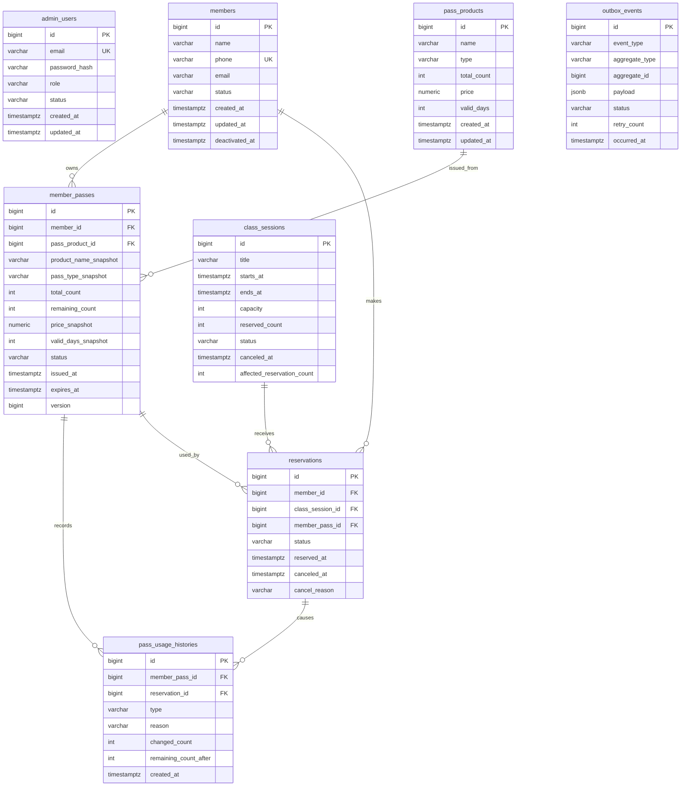

# ClimbDesk Database Design v0.1

> **Source of truth notice**
>
> The source of truth for this document is the Notion page `06 - Database Design`.
> This Markdown file is a repository-local snapshot exported on 2026-05-08 for implementation reference.
> Do not treat this snapshot as an independent design decision record when it conflicts with Notion.

> 목적: ClimbDesk MVP의 데이터 모델, 제약조건, 인덱스, 트랜잭션/락 쿼리, 마이그레이션 기준을 정의한다.

---

# 1. 문서 상태

## Status

```plain text
Draft
```

## Source Documents

- `01 - PRD`: MVP 범위, 핵심 비즈니스 규칙, 성공 기준
- `02 - Functional Spec`: 기능 행위, 트랜잭션 규칙, 동시성 정책
- `03 - Domain Model`: Aggregate, 상태 전이, Repository 경계, 이벤트 정책
- `04 - API Spec`: REST API 계약, error code, DTO 기준
- `05 - Architecture`: 레이어 구조, Port/Adapter, 트랜잭션/이벤트 아키텍처

## 작성 원칙

- DB는 도메인 불변조건을 보조하는 마지막 방어선으로 사용한다.
- 핵심 정합성은 Application Service 트랜잭션 + Aggregate 메서드 + DB constraint 조합으로 보장한다.
- 예약 정원 초과, 중복 예약, 이용권 음수 차감은 DB 레벨에서도 방어한다.
- MVP는 PostgreSQL 기준으로 설계한다.
- 테스트는 H2 대신 PostgreSQL Testcontainers 사용을 권장한다.
- JPA Entity는 DB 스키마를 반영하되, 도메인 Aggregate 행위를 우회해 상태를 변경하지 않는다.

---

# 2. Database Assumptions

## Target DBMS

```plain text
PostgreSQL 16+
```

## Managed Database Policy

개발/배포용 관리형 PostgreSQL은 Neon을 기준으로 설정한다.
애플리케이션은 Neon 연결 정보를 환경 변수로 주입받으며, DB URL, 사용자명, 비밀번호 같은 secret은 repository에 저장하지 않는다.
자동화된 통합 테스트는 Neon에 직접 연결하지 않고 PostgreSQL Testcontainers를 사용한다.

## ID Policy

```plain text
BIGINT GENERATED BY DEFAULT AS IDENTITY
```

API Spec의 MVP 예시는 `Long` ID 기준이므로 DB 기본 식별자도 BIGINT를 사용한다. 향후 UUID가 필요하면 모든 API path variable, DTO, FK 타입을 함께 변경한다.

## Time Policy

```plain text
timestamptz 사용
DB 저장 기준: UTC
API 표현 기준: ISO-8601 offset datetime
예: 2026-05-01T10:00:00+09:00
```

## Enum Policy

MVP에서는 PostgreSQL enum type 대신 `varchar + check constraint`를 사용한다.

## Deletion Policy

- 회원, 관리자, 예약, 이용권 사용 이력은 물리 삭제하지 않는다.
- 회원과 관리자는 status로 비활성화한다.
- 예약은 `CANCELED` 상태로 남긴다.
- 운영 이력 보존을 위해 FK는 기본적으로 `RESTRICT`를 사용한다.

---

# 3. ERD Overview



---

# 4. Table Design

## 4.1 admin_users

### Responsibility

관리자 인증 대상, Role, 활성 상태를 저장한다.

### Columns

| Column | Type | Nullable | Description |
| --- | --- | --- | --- |
| id | bigint | no | PK |
| email | varchar(255) | no | 로그인 식별자 |
| password_hash | varchar(255) | no | 해시된 비밀번호 |
| role | varchar(20) | no | MANAGER, STAFF |
| status | varchar(20) | no | ACTIVE, INACTIVE |
| created_at | timestamptz | no | 생성 시각 |
| updated_at | timestamptz | no | 수정 시각 |

### Constraints and Indexes

```sql
alter table admin_users
  add constraint uk_admin_users_email unique (email),
  add constraint ck_admin_users_role check (role in ('MANAGER', 'STAFF')),
  add constraint ck_admin_users_status check (status in ('ACTIVE', 'INACTIVE'));

create index idx_admin_users_status_role
  on admin_users (status, role);
```

### Notes

- 마지막 ACTIVE MANAGER 보호는 cross-row invariant이므로 DB check constraint로 표현하지 않는다.
- `countActiveManagers()`를 Application Service 트랜잭션 안에서 검증한다.

## 4.2 members

### Columns

| Column | Type | Nullable | Description |
| --- | --- | --- | --- |
| id | bigint | no | PK |
| name | varchar(100) | no | 회원 이름 |
| phone | varchar(30) | no | 회원 전화번호, unique |
| email | varchar(255) | yes | 선택 이메일 |
| status | varchar(20) | no | ACTIVE, INACTIVE |
| created_at | timestamptz | no | 생성 시각 |
| updated_at | timestamptz | no | 수정 시각 |
| deactivated_at | timestamptz | yes | 비활성화 시각 |

```sql
alter table members
  add constraint uk_members_phone unique (phone),
  add constraint ck_members_status check (status in ('ACTIVE', 'INACTIVE')),
  add constraint ck_members_deactivated_at check (
    (status = 'INACTIVE' and deactivated_at is not null)
    or (status = 'ACTIVE')
  );

create index idx_members_created_at_id
  on members (created_at desc, id desc);

create index idx_members_status
  on members (status);
```

## 4.3 pass_products

| Column | Type | Nullable | Description |
| --- | --- | --- | --- |
| id | bigint | no | PK |
| name | varchar(100) | no | 상품명 |
| type | varchar(30) | no | COUNT_PASS |
| total_count | integer | no | 총 사용 가능 횟수 |
| price | numeric(12,0) | yes | 상품 가격 |
| valid_days | integer | yes | 발급일 기준 유효 기간 일수 |
| created_at | timestamptz | no | 생성 시각 |
| updated_at | timestamptz | no | 수정 시각 |

```sql
alter table pass_products
  add constraint ck_pass_products_type check (type in ('COUNT_PASS')),
  add constraint ck_pass_products_total_count check (total_count >= 1),
  add constraint ck_pass_products_price check (price is null or price >= 0),
  add constraint ck_pass_products_valid_days check (valid_days is null or valid_days >= 1);
```

## 4.4 member_passes

### Columns

| Column | Type | Nullable | Description |
| --- | --- | --- | --- |
| id | bigint | no | PK |
| member_id | bigint | no | members FK |
| pass_product_id | bigint | no | pass_products FK |
| product_name_snapshot | varchar(100) | no | 발급 당시 상품명 |
| pass_type_snapshot | varchar(30) | no | 발급 당시 상품 유형 |
| total_count | integer | no | 발급 당시 총 횟수 |
| remaining_count | integer | no | 잔여 횟수 |
| price_snapshot | numeric(12,0) | yes | 발급 당시 가격 |
| valid_days_snapshot | integer | yes | 발급 당시 유효 기간 |
| status | varchar(20) | no | ACTIVE, EXHAUSTED, EXPIRED, CANCELED |
| issued_at | timestamptz | no | 발급 시각 |
| expires_at | timestamptz | yes | 만료 시각 |
| version | bigint | no | optimistic lock version |

```sql
alter table member_passes
  add constraint fk_member_passes_member
    foreign key (member_id) references members (id) on delete restrict,
  add constraint fk_member_passes_pass_product
    foreign key (pass_product_id) references pass_products (id) on delete restrict,
  add constraint ck_member_passes_status check (
    status in ('ACTIVE', 'EXHAUSTED', 'EXPIRED', 'CANCELED')
  ),
  add constraint ck_member_passes_count_range check (
    total_count >= 1
    and remaining_count >= 0
    and remaining_count <= total_count
  ),
  add constraint ck_member_passes_version check (version >= 0),
  add constraint ck_member_passes_valid_days_snapshot check (
    valid_days_snapshot is null or valid_days_snapshot >= 1
  ),
  add constraint ck_member_passes_expires_after_issued check (
    expires_at is null or expires_at > issued_at
  );

create index idx_member_passes_available_selection
  on member_passes (member_id, status, expires_at asc nulls last, issued_at asc, id asc)
  where status = 'ACTIVE' and remaining_count > 0;
```

### Available Pass Selection Query

```sql
select *
from member_passes
where member_id = :memberId
  and status = 'ACTIVE'
  and remaining_count > 0
  and (expires_at is null or expires_at > :now)
order by expires_at asc nulls last,
         issued_at asc,
         id asc
limit 1;
```

## 4.5 pass_usage_histories

| Column | Type | Nullable | Description |
| --- | --- | --- | --- |
| id | bigint | no | PK |
| member_pass_id | bigint | no | member_passes FK |
| reservation_id | bigint | no | reservations FK |
| type | varchar(20) | no | CONSUME, RESTORE |
| reason | varchar(40) | no | RESERVATION_CONFIRMED, RESERVATION_CANCELED, CLASS_SESSION_CANCELED |
| changed_count | integer | no | CONSUME=-1, RESTORE=+1 |
| remaining_count_after | integer | no | 변경 후 잔여 횟수 |
| created_at | timestamptz | no | 이력 생성 시각 |

```sql
alter table pass_usage_histories
  add constraint fk_pass_usage_histories_member_pass
    foreign key (member_pass_id) references member_passes (id) on delete restrict,
  add constraint fk_pass_usage_histories_reservation
    foreign key (reservation_id) references reservations (id) on delete restrict,
  add constraint ck_pass_usage_histories_type check (type in ('CONSUME', 'RESTORE')),
  add constraint ck_pass_usage_histories_reason check (
    reason in (
      'RESERVATION_CONFIRMED',
      'RESERVATION_CANCELED',
      'CLASS_SESSION_CANCELED'
    )
  ),
  add constraint ck_pass_usage_histories_changed_count check (
    (type = 'CONSUME' and changed_count = -1)
    or (type = 'RESTORE' and changed_count = 1)
  ),
  add constraint ck_pass_usage_histories_remaining_count_after check (
    remaining_count_after >= 0
  );
```

## 4.6 class_sessions

| Column | Type | Nullable | Description |
| --- | --- | --- | --- |
| id | bigint | no | PK |
| title | varchar(150) | no | 수업명 |
| starts_at | timestamptz | no | 시작 시각 |
| ends_at | timestamptz | no | 종료 시각 |
| capacity | integer | no | 정원 |
| reserved_count | integer | no | CONFIRMED 예약 수 캐시 |
| status | varchar(20) | no | OPEN, CLOSED, CANCELED |
| canceled_at | timestamptz | yes | 취소 시각 |
| cancel_reason | varchar(500) | yes | 운영 메모 |
| affected_reservation_count | integer | no | 수업 취소로 영향 받은 예약 수 |

```sql
alter table class_sessions
  add constraint ck_class_sessions_status check (status in ('OPEN', 'CLOSED', 'CANCELED')),
  add constraint ck_class_sessions_time_range check (starts_at < ends_at),
  add constraint ck_class_sessions_capacity check (capacity >= 1),
  add constraint ck_class_sessions_reserved_count check (
    reserved_count >= 0 and reserved_count <= capacity
  ),
  add constraint ck_class_sessions_affected_reservation_count check (
    affected_reservation_count >= 0
  ),
  add constraint ck_class_sessions_cancel_fields check (
    (status = 'CANCELED' and canceled_at is not null)
    or (status <> 'CANCELED')
  );
```

### Pessimistic Lock Query

```sql
select *
from class_sessions
where id = :classSessionId
for update;
```

## 4.7 reservations

| Column | Type | Nullable | Description |
| --- | --- | --- | --- |
| id | bigint | no | PK |
| member_id | bigint | no | members FK |
| class_session_id | bigint | no | class_sessions FK |
| member_pass_id | bigint | no | member_passes FK |
| status | varchar(20) | no | CONFIRMED, CANCELED |
| reserved_at | timestamptz | no | 예약 확정 시각 |
| canceled_at | timestamptz | yes | 예약 취소 시각 |
| cancel_reason | varchar(40) | yes | USER_REQUESTED, CLASS_SESSION_CANCELED |

```sql
alter table reservations
  add constraint fk_reservations_member
    foreign key (member_id) references members (id) on delete restrict,
  add constraint fk_reservations_class_session
    foreign key (class_session_id) references class_sessions (id) on delete restrict,
  add constraint fk_reservations_member_pass
    foreign key (member_pass_id) references member_passes (id) on delete restrict,
  add constraint ck_reservations_status check (status in ('CONFIRMED', 'CANCELED')),
  add constraint ck_reservations_cancel_reason check (
    cancel_reason is null
    or cancel_reason in ('USER_REQUESTED', 'CLASS_SESSION_CANCELED')
  ),
  add constraint ck_reservations_cancel_fields check (
    (status = 'CONFIRMED' and canceled_at is null and cancel_reason is null)
    or (status = 'CANCELED' and canceled_at is not null and cancel_reason is not null)
  );

create unique index uk_reservations_confirmed_member_class
  on reservations (member_id, class_session_id)
  where status = 'CONFIRMED';
```

### Lock Query for Cancellation

```sql
select *
from reservations
where id = :reservationId
for update;
```

## 4.8 outbox_events

| Column | Type | Nullable | Description |
| --- | --- | --- | --- |
| id | bigint | no | PK |
| event_type | varchar(100) | no | 이벤트 타입 |
| aggregate_type | varchar(100) | no | Aggregate 타입 |
| aggregate_id | bigint | no | Aggregate ID |
| payload | jsonb | no | 이벤트 payload |
| status | varchar(20) | no | PENDING, PUBLISHED, FAILED |
| retry_count | integer | no | 재시도 횟수 |
| occurred_at | timestamptz | no | 이벤트 발생 시각 |
| published_at | timestamptz | yes | 발행 완료 시각 |
| next_retry_at | timestamptz | yes | 다음 재시도 시각 |

```sql
alter table outbox_events
  add constraint ck_outbox_events_status check (status in ('PENDING', 'PUBLISHED', 'FAILED')),
  add constraint ck_outbox_events_retry_count check (retry_count >= 0),
  add constraint ck_outbox_events_published_at check (
    (status = 'PUBLISHED' and published_at is not null)
    or (status <> 'PUBLISHED')
  );
```

---

# 5. Full Initial Table DDL

```sql
create table admin_users (
  id bigint generated by default as identity primary key,
  email varchar(255) not null,
  password_hash varchar(255) not null,
  role varchar(20) not null,
  status varchar(20) not null,
  created_at timestamptz not null,
  updated_at timestamptz not null
);

create table members (
  id bigint generated by default as identity primary key,
  name varchar(100) not null,
  phone varchar(30) not null,
  email varchar(255),
  status varchar(20) not null,
  created_at timestamptz not null,
  updated_at timestamptz not null,
  deactivated_at timestamptz
);

create table pass_products (
  id bigint generated by default as identity primary key,
  name varchar(100) not null,
  type varchar(30) not null,
  total_count integer not null,
  price numeric(12,0),
  valid_days integer,
  created_at timestamptz not null,
  updated_at timestamptz not null
);

create table class_sessions (
  id bigint generated by default as identity primary key,
  title varchar(150) not null,
  starts_at timestamptz not null,
  ends_at timestamptz not null,
  capacity integer not null,
  reserved_count integer not null,
  status varchar(20) not null,
  created_at timestamptz not null,
  updated_at timestamptz not null,
  canceled_at timestamptz,
  cancel_reason varchar(500),
  affected_reservation_count integer not null default 0
);

create table member_passes (
  id bigint generated by default as identity primary key,
  member_id bigint not null,
  pass_product_id bigint not null,
  product_name_snapshot varchar(100) not null,
  pass_type_snapshot varchar(30) not null,
  total_count integer not null,
  remaining_count integer not null,
  price_snapshot numeric(12,0),
  valid_days_snapshot integer,
  status varchar(20) not null,
  issued_at timestamptz not null,
  expires_at timestamptz,
  version bigint not null,
  created_at timestamptz not null,
  updated_at timestamptz not null
);

create table reservations (
  id bigint generated by default as identity primary key,
  member_id bigint not null,
  class_session_id bigint not null,
  member_pass_id bigint not null,
  status varchar(20) not null,
  reserved_at timestamptz not null,
  canceled_at timestamptz,
  cancel_reason varchar(40),
  created_at timestamptz not null,
  updated_at timestamptz not null
);

create table pass_usage_histories (
  id bigint generated by default as identity primary key,
  member_pass_id bigint not null,
  reservation_id bigint not null,
  type varchar(20) not null,
  reason varchar(40) not null,
  changed_count integer not null,
  remaining_count_after integer not null,
  created_at timestamptz not null
);

create table outbox_events (
  id bigint generated by default as identity primary key,
  event_type varchar(100) not null,
  aggregate_type varchar(100) not null,
  aggregate_id bigint not null,
  payload jsonb not null,
  status varchar(20) not null,
  retry_count integer not null,
  occurred_at timestamptz not null,
  published_at timestamptz,
  next_retry_at timestamptz,
  created_at timestamptz not null,
  updated_at timestamptz not null
);
```

---

# 6. Full Initial Index DDL

```sql
create index idx_admin_users_status_role
  on admin_users (status, role);

create index idx_members_created_at_id
  on members (created_at desc, id desc);

create index idx_members_status
  on members (status);

create index idx_pass_products_created_at_id
  on pass_products (created_at desc, id desc);

create index idx_class_sessions_starts_at_id
  on class_sessions (starts_at desc, id desc);

create index idx_class_sessions_status_starts_at
  on class_sessions (status, starts_at);

create index idx_member_passes_member_id
  on member_passes (member_id);

create index idx_member_passes_member_status
  on member_passes (member_id, status);

create index idx_member_passes_available_selection
  on member_passes (member_id, status, expires_at asc nulls last, issued_at asc, id asc)
  where status = 'ACTIVE' and remaining_count > 0;

create unique index uk_reservations_confirmed_member_class
  on reservations (member_id, class_session_id)
  where status = 'CONFIRMED';

create index idx_reservations_member_reserved_at
  on reservations (member_id, reserved_at desc, id desc);

create index idx_reservations_class_session_status
  on reservations (class_session_id, status);

create index idx_reservations_member_pass_id
  on reservations (member_pass_id);

create index idx_reservations_status_reserved_at
  on reservations (status, reserved_at desc);

create index idx_pass_usage_histories_member_pass_created_at
  on pass_usage_histories (member_pass_id, created_at desc, id desc);

create index idx_pass_usage_histories_reservation_id
  on pass_usage_histories (reservation_id);

create index idx_outbox_events_pending
  on outbox_events (status, next_retry_at asc nulls first, id asc)
  where status in ('PENDING', 'FAILED');

create index idx_outbox_events_aggregate
  on outbox_events (aggregate_type, aggregate_id);

create index idx_outbox_events_occurred_at
  on outbox_events (occurred_at desc, id desc);
```

---

# 7. Core Transaction Queries

## 7.1 Reservation Create Transaction

### Invariant

```plain text
예약 생성, 좌석 증가, 이용권 차감, 사용 이력 기록, OutboxEvent 저장은 하나의 트랜잭션이다.
```

### SQL Flow

```sql
begin;

select *
from members
where id = :memberId;

select *
from class_sessions
where id = :classSessionId
for update;

select exists (
  select 1
  from reservations
  where member_id = :memberId
    and class_session_id = :classSessionId
    and status = 'CONFIRMED'
);

select *
from member_passes
where member_id = :memberId
  and status = 'ACTIVE'
  and remaining_count > 0
  and (expires_at is null or expires_at > :now)
order by expires_at asc nulls last,
         issued_at asc,
         id asc
limit 1;

update class_sessions
set reserved_count = reserved_count + 1,
    updated_at = :now
where id = :classSessionId
  and status = 'OPEN'
  and reserved_count < capacity;

insert into reservations (
  member_id,
  class_session_id,
  member_pass_id,
  status,
  reserved_at,
  created_at,
  updated_at
) values (
  :memberId,
  :classSessionId,
  :memberPassId,
  'CONFIRMED',
  :now,
  :now,
  :now
)
returning id;

update member_passes
set remaining_count = remaining_count - 1,
    status = case
      when remaining_count - 1 = 0 then 'EXHAUSTED'
      else status
    end,
    version = version + 1,
    updated_at = :now
where id = :memberPassId
  and version = :expectedVersion
  and status = 'ACTIVE'
  and remaining_count > 0;

insert into pass_usage_histories (
  member_pass_id,
  reservation_id,
  type,
  reason,
  changed_count,
  remaining_count_after,
  created_at
) values (
  :memberPassId,
  :reservationId,
  'CONSUME',
  'RESERVATION_CONFIRMED',
  -1,
  :remainingCountAfter,
  :now
);

insert into outbox_events (
  event_type,
  aggregate_type,
  aggregate_id,
  payload,
  status,
  retry_count,
  occurred_at,
  created_at,
  updated_at
) values (
  'ReservationConfirmedEvent',
  'Reservation',
  :reservationId,
  :payload::jsonb,
  'PENDING',
  0,
  :now,
  :now,
  :now
);

commit;
```

## 7.2 Reservation Cancel Transaction

```sql
begin;

select *
from reservations
where id = :reservationId
for update;

select *
from class_sessions
where id = :classSessionId
for update;

update reservations
set status = 'CANCELED',
    canceled_at = :now,
    cancel_reason = 'USER_REQUESTED',
    updated_at = :now
where id = :reservationId
  and status = 'CONFIRMED';

update class_sessions
set reserved_count = reserved_count - 1,
    updated_at = :now
where id = :classSessionId
  and reserved_count > 0;

update member_passes
set remaining_count = remaining_count + 1,
    status = case
      when status = 'EXHAUSTED'
       and remaining_count + 1 > 0
       and (expires_at is null or expires_at > :now)
      then 'ACTIVE'
      else status
    end,
    version = version + 1,
    updated_at = :now
where id = :memberPassId
  and version = :expectedVersion
  and status <> 'CANCELED'
  and remaining_count < total_count;

insert into pass_usage_histories (
  member_pass_id,
  reservation_id,
  type,
  reason,
  changed_count,
  remaining_count_after,
  created_at
) values (
  :memberPassId,
  :reservationId,
  'RESTORE',
  'RESERVATION_CANCELED',
  1,
  :remainingCountAfter,
  :now
);

insert into outbox_events (
  event_type,
  aggregate_type,
  aggregate_id,
  payload,
  status,
  retry_count,
  occurred_at,
  created_at,
  updated_at
) values (
  'ReservationCanceledEvent',
  'Reservation',
  :reservationId,
  :payload::jsonb,
  'PENDING',
  0,
  :now,
  :now,
  :now
);

commit;
```

## 7.3 Class Session Cancel Transaction

```sql
begin;

select *
from class_sessions
where id = :classSessionId
for update;

select *
from reservations
where class_session_id = :classSessionId
  and status = 'CONFIRMED'
order by id asc
for update;

update class_sessions
set status = 'CANCELED',
    reserved_count = 0,
    canceled_at = :now,
    cancel_reason = :cancelReason,
    affected_reservation_count = :affectedReservationCount,
    updated_at = :now
where id = :classSessionId
  and status <> 'CANCELED';

update reservations
set status = 'CANCELED',
    canceled_at = :now,
    cancel_reason = 'CLASS_SESSION_CANCELED',
    updated_at = :now
where class_session_id = :classSessionId
  and status = 'CONFIRMED';

insert into outbox_events (
  event_type,
  aggregate_type,
  aggregate_id,
  payload,
  status,
  retry_count,
  occurred_at,
  created_at,
  updated_at
) values (
  'ClassSessionCanceledEvent',
  'ClassSession',
  :classSessionId,
  :payload::jsonb,
  'PENDING',
  0,
  :now,
  :now,
  :now
);

commit;
```

---

# 8. Repository Query Mapping

## AdminUserRepository

```plain text
findByEmail(email)
existsByEmail(email)
findById(id)
countActiveManagers()
save(adminUser)
```

```sql
select * from admin_users where email = :email;
select count(*) from admin_users where role = 'MANAGER' and status = 'ACTIVE';
```

## MemberRepository

```plain text
findById(id)
existsByPhone(phone)
save(member)
findPage(pageable)
```

## MemberPassRepository

```plain text
findById(id)
findAvailablePassForUse(memberId, now)
findByMemberId(memberId, pageable)
save(memberPass)
```

## ClassSessionRepository

```plain text
findById(id)
findByIdForUpdate(id)
save(classSession)
findPage(pageable)
```

## ReservationRepository

```plain text
findById(id)
findByIdForUpdate(id)
existsConfirmedByMemberIdAndClassSessionId(memberId, classSessionId)
findConfirmedByClassSessionIdForUpdate(classSessionId)
findPage(filters, pageable)
save(reservation)
```

## OutboxEventRepository

```plain text
save(outboxEvent)
findPendingEvents(limit)
markPublished(eventId)
markFailed(eventId, nextRetryAt)
```

```sql
select *
from outbox_events
where status in ('PENDING', 'FAILED')
  and (next_retry_at is null or next_retry_at <= :now)
order by next_retry_at asc nulls first, id asc
limit :limit
for update skip locked;
```

---

# 9. Invariant Coverage Matrix

| Invariant | Application/Aggregate | Database |
| --- | --- | --- |
| ACTIVE 회원만 예약 가능 | ReservationApplicationService | FK only. status check는 app 책임 |
| OPEN 수업만 예약 가능 | ClassSession.reserveSeat() | conditional update 방어 |
| reservedCount <= capacity | ClassSession.reserveSeat() | `ck_class_sessions_reserved_count` |
| remainingCount >= 0 | MemberPass.consume() | `ck_member_passes_count_range` |
| CONFIRMED 중복 예약 불가 | pre-check | partial unique index |
| CANCELED 예약 후 재예약 가능 | Reservation policy | partial unique index 조건 |
| 예약 생성 원자성 | `@Transactional` | single transaction |
| 예약 취소 원자성 | `@Transactional` | single transaction |
| 수업 취소 원자성 | `@Transactional` | single transaction |
| MemberPass 차감/복구 충돌 감지 | `@Version` | `where version = ?` update |
| 마지막 ACTIVE MANAGER 보호 | AdminUserApplicationService | app 책임 |
| 이벤트 소실 방지 | OutboxEventRecorder | outbox_events insert in transaction |

---

# 10. JPA Mapping Notes

## Entity Naming

```plain text
AdminUserJpaEntity -> admin_users
MemberJpaEntity -> members
PassProductJpaEntity -> pass_products
MemberPassJpaEntity -> member_passes
PassUsageHistoryJpaEntity -> pass_usage_histories
ClassSessionJpaEntity -> class_sessions
ReservationJpaEntity -> reservations
OutboxEventJpaEntity -> outbox_events
```

## Optimistic Lock

```kotlin
@Version
@Column(name = "version", nullable = false)
var version: Long = 0
```

적용 대상:

```plain text
MemberPassJpaEntity
```

## Pessimistic Lock

```kotlin
@Lock(LockModeType.PESSIMISTIC_WRITE)
@Query("select c from ClassSessionJpaEntity c where c.id = :id")
fun findByIdForUpdate(id: Long): ClassSessionJpaEntity?
```

## Partial Unique Index

JPA annotation만으로 표현하지 말고 migration SQL에 명시한다.

```sql
create unique index uk_reservations_confirmed_member_class
  on reservations (member_id, class_session_id)
  where status = 'CONFIRMED';
```

---

# 11. Migration Plan

## V1__create_core_tables.sql

```plain text
admin_users
members
pass_products
class_sessions
member_passes
reservations
pass_usage_histories
outbox_events
```

## V2__create_core_indexes.sql

```plain text
조회/정렬 인덱스
available pass selection index
reservation partial unique index
outbox pending index
```

## V3__seed_initial_admin_user.sql

선택 사항이다. 로컬 개발과 포트폴리오 데모를 위해 초기 MANAGER 계정을 seed할 수 있다.

```plain text
email: manager@climbdesk.local
role: MANAGER
status: ACTIVE
```

비밀번호 해시는 환경별로 생성한다. 원문 비밀번호를 migration에 직접 저장하지 않는다.

---

# 12. Test Requirements

## Constraint Tests

- 중복 admin email 저장 실패
- 중복 member phone 저장 실패
- capacity < 1 class session 저장 실패
- starts_at >= ends_at class session 저장 실패
- reserved_count > capacity 저장 실패
- remaining_count < 0 member pass 저장 실패
- CONFIRMED 중복 reservation 저장 실패
- CANCELED reservation 이력 존재 시 같은 member/class 재예약 성공

## Transaction Tests

- 예약 생성 중 MemberPass update 실패 시 Reservation/ClassSession/OutboxEvent rollback
- 예약 취소 중 MemberPass restore 실패 시 Reservation/ClassSession rollback
- 수업 취소 중 일부 MemberPass restore 실패 시 전체 rollback
- OutboxEvent가 도메인 상태 변경과 같은 transaction에 저장되는지 검증

## Concurrency Tests

- 같은 ClassSession에 capacity 초과 동시 예약 요청 시 reserved_count <= capacity 유지
- 같은 member/class 동시 예약 요청 시 하나만 CONFIRMED
- 같은 MemberPass 동시 차감 충돌 시 version conflict 발생
- 수업 취소와 예약 생성 동시 요청 시 ClassSession row lock으로 직렬화

---

# 13. Resolved Decisions

## RD-01. DBMS

```plain text
PostgreSQL을 기준 DBMS로 사용한다.
```

## RD-01A. Managed Development Database

```plain text
개발/배포용 관리형 PostgreSQL은 Neon을 사용한다.
```

Neon 연결 정보는 환경 변수로만 주입한다.
테스트 자동화는 Neon이 아니라 PostgreSQL Testcontainers를 사용한다.

## RD-02. Duplicate Reservation

```plain text
PostgreSQL partial unique index로 CONFIRMED 예약 중복을 방지한다.
```

## RD-03. Lock Strategy

```plain text
ClassSession은 pessimistic lock, MemberPass는 optimistic lock을 사용한다.
```

## RD-04. Outbox

```plain text
MVP에서 OutboxEvent 테이블을 포함한다.
외부 broker 발행은 future expansion이다.
```

## RD-05. Enum Storage

```plain text
DB enum type 대신 varchar + check constraint를 사용한다.
```

## RD-06. Physical Deletion

```plain text
운영 이력 보존을 위해 핵심 도메인 데이터는 물리 삭제하지 않는다.
```

---

# 14. Open Decisions

## OD-01. ID 전략 UUID 전환 여부

MVP는 BIGINT를 사용한다. 외부 공개 API 안정성이 더 중요해지면 UUID 전환을 검토한다.

## OD-02. ClassSession CLOSED 전환 정책

API Spec에는 수업 취소만 MVP endpoint로 정의되어 있다. `CLOSED` 상태 자동 전환 배치 또는 수동 endpoint는 MVP 이후 결정한다.

## OD-03. MemberPass EXPIRED 배치

예약 생성 시점 만료 검증은 MVP에 포함한다. 만료 상태를 주기적으로 `EXPIRED`로 전환하는 배치는 MVP 이후 결정할 수 있다.

## OD-04. Outbox Publisher 구현 시점

MVP는 OutboxEvent 저장을 구현한다. `PENDING -> PUBLISHED/FAILED` 상태 전환 publisher는 확장 단계에서 구현한다.

---

# Appendix A. Portable Duplicate Constraint Alternative

PostgreSQL partial unique index를 사용할 수 없는 DBMS라면 `active_reservation_key` 컬럼을 사용할 수 있다.

```sql
alter table reservations
  add column active_reservation_key varchar(100);

create unique index uk_reservations_active_reservation_key
  on reservations (active_reservation_key);
```

Application rule:

```plain text
CONFIRMED 상태일 때:
active_reservation_key = member_id + ':' + class_session_id

CANCELED 상태일 때:
active_reservation_key = null
```

MVP의 기본 설계는 PostgreSQL partial unique index를 사용하므로 이 대안은 구현하지 않는다.
