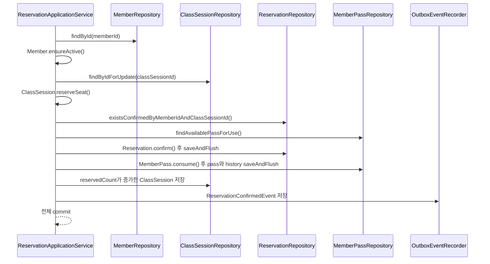
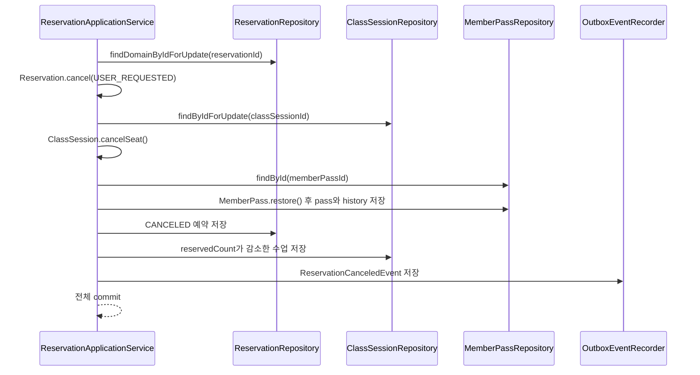

# ClimbDesk 트랜잭션·동시성 설계

## 1. 문서 목적과 범위

ClimbDesk의 예약 기능은 한 행을 저장하는 CRUD가 아니다. 예약 생성·예약 취소·수업 취소는 `Reservation`, `ClassSession`, `MemberPass`, `PassUsageHistory`, `OutboxEvent`를 하나의 트랜잭션에서 함께 변경한다. 동시에 들어오는 요청에서도 좌석, 이용권, 예약 상태가 서로 어긋나지 않아야 한다.

이 문서는 설계 의도만 설명하지 않고 다음 근거로 현재 MVP가 보장하는 동작을 정리한다.

- Application Service의 `@Transactional` 경계와 실제 호출 순서
- 도메인 모델의 상태 전이와 불변조건
- JPA repository의 비관적·낙관적 락
- Flyway migration의 PostgreSQL constraint와 partial unique index
- PostgreSQL Testcontainers 통합 테스트의 검증 결과

새 기능이나 미래 확장을 정의하지 않는다. 특히 MVP의 Outbox는 같은 트랜잭션에서 `PENDING` 행을 저장하는 범위까지이며 publisher, 실제 알림, 외부 broker, 자동 retry는 구현하지 않는다.

## 2. 핵심 불변조건과 방어 계층

| 불변조건 | 도메인·애플리케이션 방어 | PostgreSQL 방어 | 주요 테스트 근거 |
| --- | --- | --- | --- |
| `ClassSession.reservedCount <= capacity` | `ClassSession.reserveSeat()`가 만석을 거부하고 예약 생성 시 `ClassSession` 행을 비관적 락으로 조회 | `ck_class_sessions_reserved_count` | `ClassSessionTest`, `ReservationCreationIntegrationTest` |
| `MemberPass.remainingCount >= 0` | `MemberPass.consume()`이 사용할 수 없는 이용권을 거부하고 JPA `@Version`으로 경합을 감지 | `ck_member_passes_count_range`, `ck_pass_usage_histories_remaining_count_after` | `MemberPassTest`, `MemberPassPersistenceAdapterIntegrationTest`, `ReservationMemberPassOptimisticLockIntegrationTest` |
| 동일 회원·수업의 `CONFIRMED` 예약은 최대 1개 | `existsConfirmedByMemberIdAndClassSessionId()` 사전 검증 | partial unique index `uk_reservations_confirmed_member_class` | `MvpSchemaMigrationTest`, `ReservationCreationIntegrationTest`, `ReservationPersistenceAdapterTest` |

핵심 구현 위치:

- [`ClassSession`](../src/main/kotlin/dev/climbdesk/classsession/domain/ClassSession.kt)
- [`MemberPass`](../src/main/kotlin/dev/climbdesk/pass/domain/MemberPass.kt)
- [`Reservation`](../src/main/kotlin/dev/climbdesk/reservation/domain/Reservation.kt)
- [`V1__create_mvp_schema.sql`](../src/main/resources/db/migration/V1__create_mvp_schema.sql)

도메인 검증과 DB constraint는 역할이 다르다. 도메인은 정상 유스케이스에서 의미 있는 오류를 반환하고, DB는 애플리케이션 검증을 우회하거나 경합이 발생해도 잘못된 최종 상태가 저장되지 않게 하는 마지막 방어선이다.

## 3. 예약 생성 transaction boundary

트랜잭션 경계는 [`ReservationApplicationService.reserveClass()`](../src/main/kotlin/dev/climbdesk/reservation/application/ReservationApplicationService.kt)에 선언된 `@Transactional`이다.

실제 구현 순서는 다음과 같다.



단계별 보장은 다음과 같다.

1. `MemberRepository.findById()`로 회원을 조회하고 `Member.ensureActive()`로 `ACTIVE` 여부를 확인한다.
2. `ClassSessionRepository.findByIdForUpdate()`로 수업 행에 PostgreSQL write lock을 획득한다.
3. `ClassSession.reserveSeat()`가 `OPEN` 상태와 정원을 확인한 뒤 메모리상의 `reservedCount`를 증가시킨다.
4. `ReservationRepository.existsConfirmedByMemberIdAndClassSessionId()`로 중복 예약을 사전 검증한다.
5. `MemberPassRepository.findAvailablePassForUse()`가 `ACTIVE`, 잔여 횟수, 만료 시각을 기준으로 사용할 이용권 한 건을 선택한다.
6. `Reservation.confirm()`으로 `CONFIRMED` 예약을 만들고 먼저 저장한다.
7. `MemberPass.consume()`이 잔여 횟수를 1 줄이고 `CONSUME / RESERVATION_CONFIRMED` 이력을 만든다. `saveUsageResult()`가 이용권과 이력을 함께 flush한다.
8. 증가한 `ClassSession`을 저장한다.
9. `ReservationConfirmedEvent`를 `outbox_events`에 `PENDING`으로 저장한다.

`Reservation`이 중간에 먼저 flush되더라도 독립적으로 commit되지 않는다. 이후 이용권 저장, 수업 저장, outbox 저장 중 하나가 실패하면 같은 트랜잭션의 예약 insert도 함께 rollback된다.

## 4. 예약 취소 transaction boundary

트랜잭션 경계는 [`ReservationApplicationService.cancelReservation()`](../src/main/kotlin/dev/climbdesk/reservation/application/ReservationApplicationService.kt)의 `@Transactional`이다.



- `Reservation` 행을 먼저 비관적 락으로 조회하므로 같은 예약의 동시 취소는 직렬화된다.
- `Reservation.cancel()`은 이미 취소된 예약의 두 번째 상태 변경을 `RESERVATION_ALREADY_CANCELED`로 거부한다.
- `ClassSession` 행도 비관적 락으로 조회하고 `cancelSeat()`로 좌석을 1개 복구한다.
- `MemberPass.restore()`는 잔여 횟수를 1 늘리고 `RESTORE / RESERVATION_CANCELED` 이력을 만든다.
- 저장 과정의 `ObjectOptimisticLockingFailureException`은 `MEMBER_PASS_VERSION_CONFLICT`로 매핑된다.
- 마지막에 `ReservationCanceledEvent`를 같은 트랜잭션의 outbox에 저장한다.

## 5. 수업 취소 transaction boundary

수업 취소는 [`ClassSessionApplicationService.cancelClassSession()`](../src/main/kotlin/dev/climbdesk/classsession/application/ClassSessionApplicationService.kt)의 `@Transactional`에서 처리한다.

1. `ClassSessionRepository.findByIdForUpdate()`로 대상 수업을 잠근다.
2. `ReservationRepository.findConfirmedByClassSessionIdForUpdate()`로 해당 수업의 `CONFIRMED` 예약을 ID 오름차순으로 잠가 조회한다.
3. 각 예약의 `MemberPass`를 복구하고 `RESTORE / CLASS_SESSION_CANCELED` 이력을 저장한다.
4. 각 예약을 `CANCELED / CLASS_SESSION_CANCELED`로 저장한다.
5. `ClassSession.cancel()`이 수업을 `CANCELED`로 바꾸고 `reservedCount = 0`, `affectedReservationCount = 취소한 예약 수`로 만든다.
6. `ClassSessionCanceledEvent`를 같은 트랜잭션의 outbox에 저장한다.

중간 예약 하나의 이용권 복구나 마지막 outbox 저장이 실패하면 앞에서 처리한 예약, 이용권, 이력까지 모두 rollback된다.

## 6. 동시성 제어

### 6.1 ClassSession 비관적 락

[`ClassSessionJpaRepository.findByIdForUpdate()`](../src/main/kotlin/dev/climbdesk/classsession/infrastructure/persistence/ClassSessionJpaRepository.kt)는 `@Lock(LockModeType.PESSIMISTIC_WRITE)`를 사용한다.

예약 생성과 수업 취소가 같은 수업 행을 먼저 잠그므로 다음 경합이 직렬화된다.

- 여러 회원이 마지막 좌석을 동시에 예약
- 예약 취소와 새 예약이 동시에 실행
- 수업 취소와 새 예약이 동시에 실행

락을 획득한 트랜잭션이 최신 `reservedCount`와 수업 상태를 검증하고 저장한 뒤 다음 요청이 진행된다. 락 timeout이 발생하면 해당 요청은 실패하며 부분 변경은 남지 않는다. 자동 retry는 하지 않는다.

예약 취소는 [`ReservationJpaRepository.findByIdForUpdate()`](../src/main/kotlin/dev/climbdesk/reservation/infrastructure/persistence/ReservationJpaRepository.kt)로 예약 행도 잠가 동일 예약의 중복 취소를 직렬화한다.

### 6.2 MemberPass 낙관적 락

[`MemberPassJpaEntity.version`](../src/main/kotlin/dev/climbdesk/pass/infrastructure/persistence/MemberPassJpaEntity.kt)은 JPA `@Version` 필드다.

서로 다른 수업 트랜잭션이 같은 이용권 snapshot을 동시에 차감하거나 복구하면 한 저장만 version 조건을 만족한다. 뒤늦게 저장하는 트랜잭션은 `ObjectOptimisticLockingFailureException`을 받고 전체 rollback된다.

`ReservationApplicationService`와 `ClassSessionApplicationService`는 이 예외를 `MEMBER_PASS_VERSION_CONFLICT`로 변환한다. MVP 정책은 호출자에게 충돌을 반환하는 것이며 서비스 내부 자동 retry는 없다.

## 7. 중복 예약 방어

중복 `CONFIRMED` 예약은 두 단계로 막는다.

1. Application pre-check: `ReservationRepository.existsConfirmedByMemberIdAndClassSessionId()`
2. PostgreSQL partial unique index:

```sql
create unique index uk_reservations_confirmed_member_class
  on reservations (member_id, class_session_id)
  where status = 'CONFIRMED';
```

partial 조건 때문에 기존 예약이 `CANCELED`가 된 뒤 같은 회원이 같은 수업을 다시 예약하는 것은 허용된다.

[`ReservationPersistenceAdapter.save()`](../src/main/kotlin/dev/climbdesk/reservation/infrastructure/persistence/ReservationPersistenceAdapter.kt)는 이 index 위반을 `DUPLICATE_RESERVATION`으로 매핑한다. 사전 검증은 일반 실패를 빠르고 명확하게 처리하고, unique index는 경합이나 우회 insert에서도 최종 중복을 차단한다.

## 8. rollback과 원자성

다음 항목은 각각 독립 저장처럼 보이지만 Application Service의 단일 트랜잭션 안에서만 commit된다.

| 유스케이스 | 함께 commit 또는 rollback되는 상태 |
| --- | --- |
| 예약 생성 | `Reservation CONFIRMED`, 좌석 증가, 이용권 차감, `CONSUME` 이력, `ReservationConfirmedEvent` |
| 예약 취소 | `Reservation CANCELED`, 좌석 감소, 이용권 복구, `RESTORE` 이력, `ReservationCanceledEvent` |
| 수업 취소 | 수업과 기존 예약 취소, 모든 이용권 복구, 모든 `RESTORE` 이력, `reservedCount = 0`, `ClassSessionCanceledEvent` |

실패 주입 테스트는 다음을 실제 PostgreSQL 상태로 재조회한다.

- 예약 생성 중 이용권 version conflict: 예약·이력·outbox가 없고 좌석과 이용권이 원래 값
- 예약 생성 중 outbox 저장 실패: 앞선 예약 insert와 이용권·좌석 변경까지 rollback
- 예약 취소 중 이용권 version conflict 또는 outbox 저장 실패: 예약은 계속 `CONFIRMED`, 좌석과 이용권은 원래 값
- 수업 취소 중 일부 이용권 복구 또는 outbox 저장 실패: 수업과 모든 예약·이용권·이력이 취소 전 상태

## 9. OutboxEvent의 MVP 범위

[`OutboxEventPersistenceAdapter`](../src/main/kotlin/dev/climbdesk/event/infrastructure/persistence/OutboxEventPersistenceAdapter.kt)의 `record()`는 `Propagation.MANDATORY`다. 따라서 호출자의 트랜잭션이 없으면 저장할 수 없고, 도메인 상태 변경과 별도 트랜잭션으로 분리되지 않는다.

`OutboxEvent.pending()`은 다음 초기 상태를 만든다.

- `status = PENDING`
- `retryCount = 0`
- 이벤트 payload는 PostgreSQL `jsonb`에 저장

현재 public API는 없으며 publisher, `PENDING -> PUBLISHED/FAILED` 처리, 실제 알림, 외부 broker 연동은 구현되어 있지 않다. 테이블에 `retry_count`, `published_at`, `next_retry_at` 컬럼이 존재하는 것은 향후 확장을 위한 스키마이며 자동 retry 구현을 의미하지 않는다.

## 10. PostgreSQL constraint

Flyway baseline은 애플리케이션 규칙을 다음 constraint로 보조한다.

| 대상 | 이름 | 방어 내용 |
| --- | --- | --- |
| `class_sessions` | `ck_class_sessions_reserved_count` | `0 <= reserved_count <= capacity` |
| `member_passes` | `ck_member_passes_count_range` | `total_count >= 1`, `0 <= remaining_count <= total_count` |
| `member_passes` | `ck_member_passes_version` | `version >= 0` |
| `reservations` | `ck_reservations_cancel_fields` | `CONFIRMED`와 `CANCELED`의 취소 필드 일관성 |
| `pass_usage_histories` | `ck_pass_usage_histories_changed_count` | `CONSUME = -1`, `RESTORE = 1` |
| `pass_usage_histories` | `ck_pass_usage_histories_remaining_count_after` | 이력의 잔여 횟수도 음수 금지 |
| `outbox_events` | `ck_outbox_events_status`, `ck_outbox_events_retry_count` | 허용 상태와 음수 retry count 방지 |

정확한 정의는 [`V1__create_mvp_schema.sql`](../src/main/resources/db/migration/V1__create_mvp_schema.sql)과 [`V2__tighten_mvp_lifecycle_constraints.sql`](../src/main/resources/db/migration/V2__tighten_mvp_lifecycle_constraints.sql)을 기준으로 한다.

## 11. 주요 테스트 근거

모든 통합 테스트는 PostgreSQL Testcontainers와 Flyway migration schema를 사용한다.

| 테스트 클래스 | 검증 내용 |
| --- | --- |
| [`ReservationCreationIntegrationTest`](../src/test/kotlin/dev/climbdesk/reservation/presentation/ReservationCreationIntegrationTest.kt) | 생성 성공 시 예약·좌석·이용권·이력·outbox 저장, 30개 동시 요청에서 정원 10개만 성공, 동시 중복 요청에서 1개만 성공, 수업 락 timeout 시 side effect 없음 |
| [`ReservationCancellationIntegrationTest`](../src/test/kotlin/dev/climbdesk/reservation/presentation/ReservationCancellationIntegrationTest.kt) | 취소 시 좌석·이용권 복구와 이력·outbox 저장, 동시 취소 side effect 1회, 취소와 새 예약 경합 후 정합성 유지 |
| [`ClassSessionCancellationIntegrationTest`](../src/test/kotlin/dev/climbdesk/classsession/presentation/ClassSessionCancellationIntegrationTest.kt) | 기존 `CONFIRMED` 예약 일괄 취소, 이용권·이력 복구, `reservedCount = 0`, 복구 실패 시 전체 rollback, 수업 취소와 예약 생성 경합 |
| [`ReservationMemberPassOptimisticLockIntegrationTest`](../src/test/kotlin/dev/climbdesk/reservation/application/ReservationMemberPassOptimisticLockIntegrationTest.kt) | 실제 stale version 경합에서 한 트랜잭션만 commit되고 실패 요청은 `MEMBER_PASS_VERSION_CONFLICT`로 매핑되며 부분 변경이 rollback |
| [`MemberPassPersistenceAdapterIntegrationTest`](../src/test/kotlin/dev/climbdesk/pass/infrastructure/persistence/MemberPassPersistenceAdapterIntegrationTest.kt) | `@Version` stale/concurrent update 감지와 이용권 상태·이력의 단일 저장 동작 |
| [`ReservationCreationMemberPassFailureIntegrationTest`](../src/test/kotlin/dev/climbdesk/reservation/application/ReservationCreationMemberPassFailureIntegrationTest.kt) | 예약 생성 중 이용권 저장 실패 rollback |
| [`ReservationCreationOutboxFailureIntegrationTest`](../src/test/kotlin/dev/climbdesk/reservation/application/ReservationCreationOutboxFailureIntegrationTest.kt) | 예약 생성 중 outbox 저장 실패 rollback |
| [`ReservationCancellationMemberPassFailureIntegrationTest`](../src/test/kotlin/dev/climbdesk/reservation/application/ReservationCancellationMemberPassFailureIntegrationTest.kt) | 예약 취소 중 이용권 저장 실패 rollback |
| [`ReservationCancellationOutboxFailureIntegrationTest`](../src/test/kotlin/dev/climbdesk/reservation/application/ReservationCancellationOutboxFailureIntegrationTest.kt) | 예약 취소 중 outbox 저장 실패 rollback |
| [`ClassSessionCancellationOutboxFailureIntegrationTest`](../src/test/kotlin/dev/climbdesk/classsession/application/ClassSessionCancellationOutboxFailureIntegrationTest.kt) | 수업 취소 중 outbox 저장 실패 rollback |
| [`OutboxEventPersistenceAdapterIntegrationTest`](../src/test/kotlin/dev/climbdesk/event/infrastructure/persistence/OutboxEventPersistenceAdapterIntegrationTest.kt) | 세 이벤트의 `PENDING`·JSONB 저장, 호출자 트랜잭션 참여와 rollback, 트랜잭션 없는 호출 거부 |
| [`MvpSchemaMigrationTest`](../src/test/kotlin/dev/climbdesk/infrastructure/persistence/MvpSchemaMigrationTest.kt) | constraint inventory, partial unique index의 unique 여부·조건식, 수업·이용권·예약·이력·outbox DB constraint |
| [`ReservationPersistenceAdapterTest`](../src/test/kotlin/dev/climbdesk/reservation/infrastructure/persistence/ReservationPersistenceAdapterTest.kt) | `uk_reservations_confirmed_member_class` 위반만 `DUPLICATE_RESERVATION`으로 매핑 |

실행 명령:

```shell
./gradlew test
```

Docker가 실행 중이어야 `@Testcontainers(disabledWithoutDocker = true)`가 붙은 PostgreSQL 통합 테스트가 실제로 실행된다.

## 12. 관련 문서

- 도메인 Aggregate와 불변조건: [Domain Model](03-domain-model.md)
- Application Service, Port/Adapter, 트랜잭션 원칙: [Architecture](05-architecture.md)
- PostgreSQL schema, constraint, index: [Database Design](06-database-design.md)
- 테스트 범위와 환경: [Test Strategy](07-test-strategy.md)
- 구현 마일스톤: [Roadmap](09-roadmap.md)
- API로 확인하는 예약 생성·취소 흐름: [MVP API 사용 시나리오](17-mvp-api-usage-scenarios.md)
